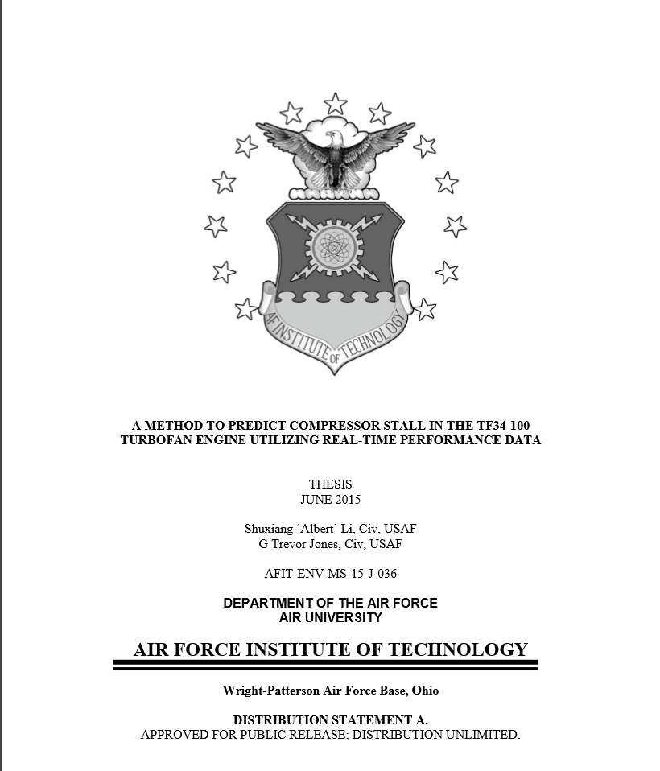
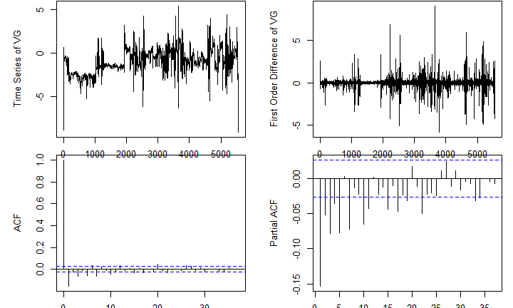

# Predict Aircraft Engine Compressor Stall
Albert Shuxiang Li  
February 5, 2016  

## Project Background

This is a simplified form of our Systems Engineering thesis, "A Method To Predict Compressor Stall In The TF34-100 Turbofan Engine Utilizing Real-Time Performance Data". 

Question to Answer: Is there an engine compressor stall fault on next flight based on current flight engine data?

VG (Variable Geometry) is calculated from 3 engine sensors (T2C, NG and IGV). Then AutoRigression Integrated Moving Average (ARIMA) method is used for time series modeling. With sampled engine training dataset, a Linear Regression Model (LRM) is fitted to associat the predictors (ARIMA coefficients) to the outcome. Therefore, this LRM can be used to predict the chance of Engine Compressor Stall on next flight.

This **ARIMA-LRM method** will be explained mathematically on next pages. 

## Original Thesis Cover



## ARIMA-LRM Method  (1)
Engine sensor data is a Time Series data.

$$X_t = f(T2C, NG, IGV)$$

$$X_t = \delta + AR_1X_{t-1} + AR_2X_{t-2} + ... + AR_pX_{t-p}$$
$$+ A_t + MA_1A_{t-1} + MA_2A_{t-2} + ... + MA_qA_{t-q}$$

Where $X_t$ is the VG value at the time $t$, $AR_i(i=1,2, ..., p)$ is the AutoRegression (AR) coefficient, and $MA_j, (j=1,2, ..., q)$ is the Moving Average (MA) coefficient. 

This model is denoted as **$arima(p,0,q)$**. 

## ARIMA-LRM Method  (2)
In the engine training dataset which contains $N$ engines, $M$ with _compressor stall_ thus outcome $y_i=1$; for others clear of faults $y_i=0$, where $(i=1,2,...,n)$.

$$\left(
\begin{matrix}
y_1\\
y_2\\
\vdots \\
y_m\\
y_{m+1}\\
\vdots\\
y_n
\end{matrix}
\right) \sim \left(
\begin{matrix}
AR_{1_1} & AR_{2_1} & \dots & AR_{p_1} & MA_{1_1} & MA_{2_1} & \dots & MA_{q_1}\\
AR_{1_2} & AR_{2_2} & \dots & AR_{p_2} & MA_{1_2} & MA_{2_2} & \dots & MA_{q_2}\\
\vdots    & \vdots    & \ddots & \vdots    & \vdots    & \vdots    & \ddots & \vdots\\
AR_{1_n} & AR_{2_n} & \dots & AR_{p_n} & MA_{1_n} & MA_{2_n} & \dots & MA_{q_n}
\end{matrix}\right)$$

## ARIMA-LRM Method  (3)
Therefore, a Linear Regression Model can be fitted as 
$$p_{ecs} = \beta_0 + \displaystyle\sum_{i=1}^{p}\beta_i*AR_i + \displaystyle\sum_{j=1}^{q}\beta_{j+p}*MA_j + \epsilon$$

## Obtained ARIMA-LRM Coefficients
From original samples in our thesis, LRM coefficients is obtained

$$\hat{p}_{ecs} = \hat{\beta_0} + \displaystyle\sum_{i=1}^{p}\hat{\beta_i}*AR_i + \displaystyle\sum_{j=1}^{q}\hat{\beta}_{j+p}*MA_j$$

$\hat{\beta_0}=0.240$ | Intercept Estimate

$\hat{\beta_1}=5.348, \hat{\beta_2}=5.967, \hat{\beta_3}=9.755, \hat{\beta_4}=-2.721$
$\hat{\beta_5}=4.616, \hat{\beta_6}=5.575, \hat{\beta_7}=-0.447, \hat{\beta_8}=2.163$
$\hat{\beta_9}=2.471, \hat{\beta}_{10}=13.484, \hat{\beta}_{11}=0.792, \hat{\beta}_{12}=11.931$
| $AR_1$ ~ $AR_{12}$ Estimates

$\hat{\beta}_{13}=5.831, \hat{\beta}_{14}=-2.100, \hat{\beta}_{15}=4.201, \hat{\beta}_{16}=-5.785$
| $MA_1$ ~ $MA_4$ Estimates

Where **$arima(12, 0, 4)$** model has been used.

## Variable Geometry Calculation Formula {.smaller}
Calculate NGC first
$$ NGC=\frac{NG}{\sqrt{\frac{T2C+273.15}{288.15}}}$$

- IF $T2C < 23.8^\circ C$
$$  VG=IGV+0.862*NGC-112.470 $$

- IF $23.8^\circ C \leq T2C \leq 37.7^\circ C$
$$  VG=IGV+(0.862*NGC-112.5)+\frac{(1.005*NGC-71.408)*(T2C-23.889)}{13.9} $$

- IF $37.7^\circ C < T2C$
$$  VG=IGV+1.439*NGC-150.898 $$

## Process in shinyapps.io Project
- Upload an example file which has four columns: GPS Time, T2C, NG and IGV
- Calculate VG values by row
- Plot $VG_t$; $diff(VG_t)$; $acf(diff(VG_t))$ and $pacf(diff(VG_t))$
- Calculate $\hat{p}_{ECS}$
    + IF $\hat{p}_{ecs}>0.5$, "**WARNING: COMPRESSOR STALL IN NEXT FLIGHT**"
    + IF $\hat{p}_{ecs}<0.5$, "**CLEAR: NORMAL CAUTION APPLY IN NEXT FLIGHT**"

## Load, Calculate and Plot Data {.smaller}


```r
par(mar=c(1.5,5,.1,1));par(mfrow=c(2, 2))
x <- read.csv("810962-1624-LEFT-example-rted.csv"); VG <- ts(vg_cal(x)); xd <- diff(VG)
plot(VG,ylab="Time Series of VG");plot(xd,ylab="First Order Difference of VG");acf(xd); pacf(xd)
```



## Calculate $arima(p,0,q)$ Coefficients
Where **$arima(12, 0, 4)$** model has been used.


```r
arimaFit <- arima(xd,order=c(12,0,4),optim.method="Nelder-Mead")
```

Coef_AR1       Coef_AR2      Coef_AR3       Coef_AR4       Coef_AR5      Coef_AR6     
-------------  ------------  -------------  -------------  ------------  -------------
-6.99633e-02   5.00714e-03   -4.27208e-03   -1.52865e-02   -9.3977e-03   -1.06113e-02 


Coef_AR7      Coef_AR8      Coef_AR9     Coef_AR10     Coef_AR11     Coef_AR12   
------------  ------------  -----------  ------------  ------------  ------------
9.70626e-03   2.69551e-02   1.4019e-03   7.45334e-03   5.45178e-03   1.39239e-02 


Coef_MA1       Coef_MA2      Coef_MA3       Coef_MA4     
-------------  ------------  -------------  -------------
-3.55007e-03   2.40141e-02   -3.27156e-03   -7.56296e-04 

## Predict Engine Compressor Stall

```r
Coef_training <- c(0.240, 5.348, 5.967, 9.755, -2.721, 4.616, 5.575, -0.447, 2.163, 
                   2.471, 13.484, 0.792, 11.931, 5.831, -2.100, 4.201, -5.785)
p <- Coef_training[1]
for (i in 1:16) {
  p <- p + as.numeric(Coef_training[i + 1]) * as.numeric(tab_coef["coef_calculated", i])
}
if ((p <- format(p, digits=2)) > 0.5) {
  cat("**WARNING: COMPRESSOR STALL IN NEXT FLIGHT  **","($\\hat p_{ecs}=",p,"$)",sep="")
} else {
  cat("**CLEAR: NORMAL CAUTION APPLY IN NEXT FLIGHT  **","($\\hat p_{ecs}=",p,"$)",sep="")
}
```

**CLEAR: NORMAL CAUTION APPLY IN NEXT FLIGHT  **($\hat p_{ecs}=0.041$)

