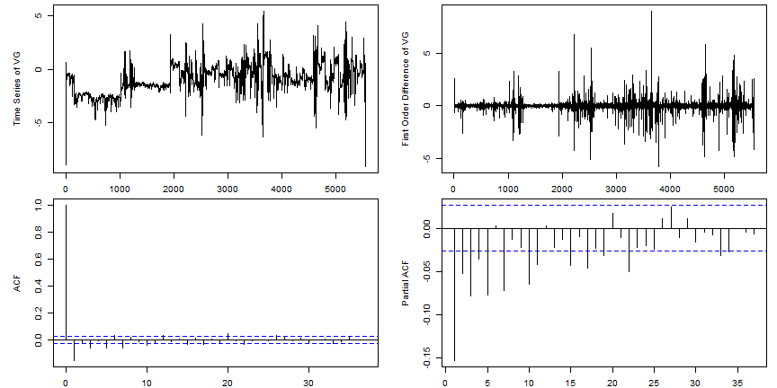

## Project Background

QUESTION TO BE ANSWERED: Is there an engine compressor stall fault on next flight based on current flight engine data?

Liner Regression algorithm is used in the Machine Learning process. And, according to our Systems Engineering thesis, "A Method To Predict Compressor Stall In The TF34-100 Turbofan Engine Utilizing Real-Time Performance Data", the selected features are $arima(p, 0, q)$ coefficients of first order difference of VG (Variable Geometry) which is calculated from 3 engine sensors (T2C, NG and IGV). 

A minimalist mathematical description for our modeling methods is on next page.

---

- ARIMA-LRM Method

An $arima(p,0,q)$ model is fitted for engine sensor data (a Time Series data):

$$X_t = f(t2c, ng, igv); X_t = \delta + C_1X_{t-1} + ... + C_pX_{t-p} + A_t + D_1A_{t-1} + ... + D_qA_{t-q}$$

Where $C_i=AR_i, D_j=MA_j$; Then $ arimaFit \\$coef[k] $ are used as predictors in a Linear Regression Model. LRM coefficients ($\hat{\beta}_0, \hat{\beta}_1, ..., \hat{\beta}_{16}$) are obtained from training dataset in our thesis, where **$arima(12, 0, 4)$** model has been used.

$$p = \beta_0 + \displaystyle\sum_{i=1}^{p}\beta_i*AR_i + \displaystyle\sum_{j=1}^{q}\beta_{j+p}*MA_j + \epsilon; \hat{p} = \hat{\beta_0} + \displaystyle\sum_{i=1}^{p}\hat{\beta_i}*AR_i + \displaystyle\sum_{j=1}^{q}\hat{\beta}_{j+p}*MA_j$$

- Process in shinyapps.io Project
  + Upload an example file which has four columns: GPS Time, T2C, NG and IGV
  + Calculate VG values ($=x$) by row; Plot $x$; $diff(x)$; $acf(diff(x))$ and $pacf(diff(x))$
  + Calculate $\hat{p}$, IF $\hat{p} > 0.5$, "**WARNING: COMPRESSOR STALL IN NEXT FLIGHT**"
  + Calculate $\hat{p}$, IF $\hat{p} < 0.5$, "**CLEAR: NORMAL CAUTION APPLY IN NEXT FLIGHT**"

--- 

## Load, Calculate and Plot Data


```r
par(mar=c(2,5,.5,1)); par(mfrow=c(2, 2)); xd <- diff(x<-ts(vg_cal(read.csv("data\\example.csv"))))
plot(x,ylab="Time Series of VG"); plot(xd,ylab="First Order Difference of VG"); acf(xd); pacf(xd)
```



--- 

## Calculate $arima(p,0,q)$ and Predict CS Faults

```r
arimaFit <- arima(xd, order = c(12,0,4), optim.method = "Nelder-Mead")
```


```r
Coef_training <- c(0.240, 5.348, 5.967, 9.755, -2.721, 4.616, 5.575, -0.447, 
                    2.163, 2.471, 13.484, 0.792, 11.931, 5.831, -2.100, 4.201, -5.785)
p <- as.numeric(Coef_training[1])
for (i in 1:16) {
  p <- p + as.numeric(Coef_training[i + 1]) * as.numeric(tab_coef["coef_calculated", i])
}
if ((p <- format(p, digits = 2)) > 0.5) {
  cat("**WARNING: COMPRESSOR STALL IN NEXT FLIGHT**", "$(\\hat p_{ecs}=", p, ")$")} else {
  cat("**CLEAR: NORMAL CAUTION APPLY IN NEXT FLIGHT**", "$(\\hat p_{ecs}=", p, ")$")
}
```

**CLEAR: NORMAL CAUTION APPLY IN NEXT FLIGHT** $(\hat p_{ecs}= 0.041 )$
